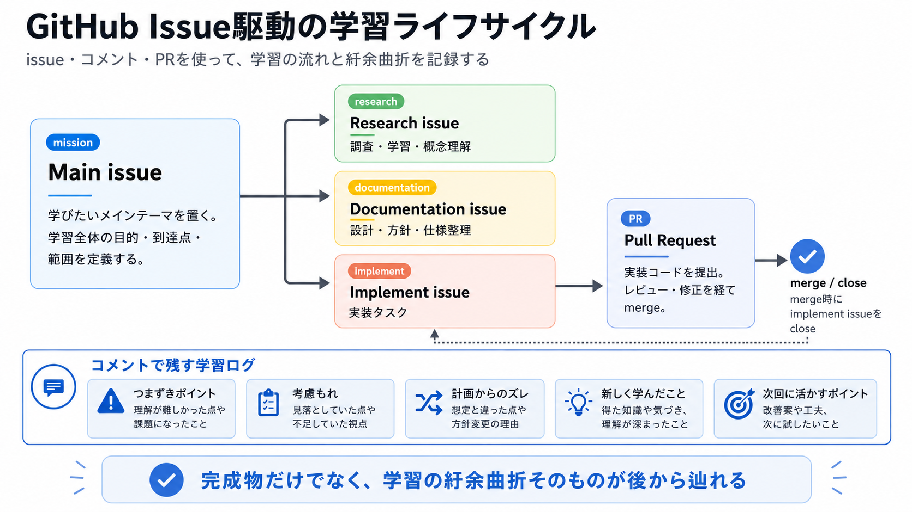
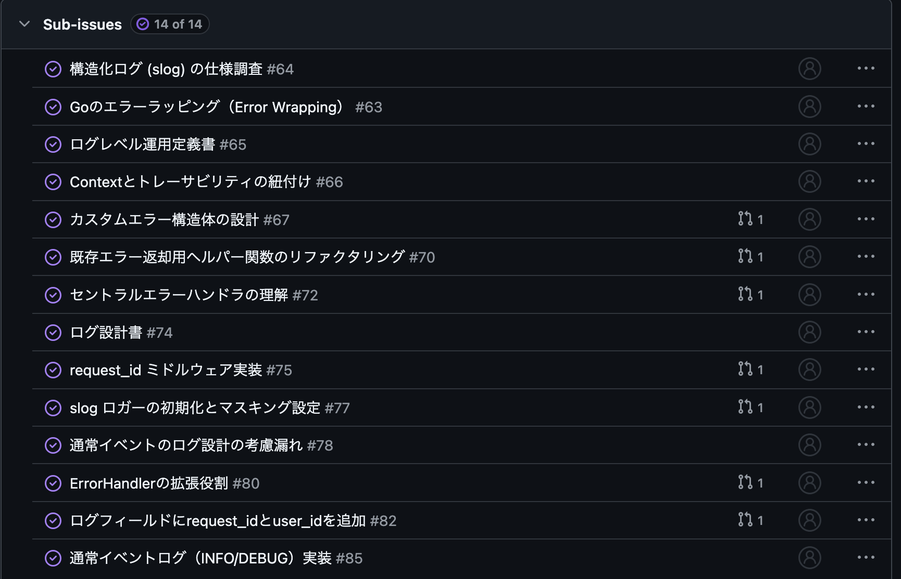

+++
date = '2026-06-06T16:29:07+09:00'
draft = false
tags = ["log"]
title = 'GitHub issueベースの学習方法'
+++

## 概要
今年からWebアプリの勉強がてら作ってる[架空ECサイト](https://github.com/mizzky/sol)の中で、何かのテーマで深掘りして学習したいと思ってロギングについて学習することにした。

インプット、設計、実装を連動させてトラッキングできるようなスタイルがよく、github issueベースの勉強を試しにやってみた。

この記事では学習全体の方針と振り返りをする。

## 計画


### 1. Main Issue
学びたいトピックでのやることリスト

今回のロギングではこんな感じ。
```markdown
## 1. 概要 (Background & Objectives)
現状、エラーハンドリングは文字列ベースの簡易的なヘルパー関数に依存しており、エラーの根本原因（Root Cause）の追跡が困難である。また、ログレベルの運用基準が未整備であり、監視やデバッグに耐えうる設計になっていない。本Issueでは、Go 1.13以降の標準的なエラー処理と、Go 1.21で導入された標準構造化ロガー（slog）を用いた堅牢な基盤を構築する。

## 2. 学習・調査タスク (Learning & Research)
- [x] **Goのエラーラッピング（Error Wrapping）の完全理解**
    - `fmt.Errorf` で `%w` を使う理由と、`%v` との違いを説明できるか。
    - `errors.Is` (値の比較) と `errors.As` (型の比較/抽出) の具体的なユースケースの把握。
- [x] **構造化ログ (slog) の仕様調査**
    - `log/slog` パッケージを用いたJSON形式出力の設定方法。
    - ログレベル（DEBUG / INFO / WARN / ERROR）の明確な運用定義の作成。
- [x] **Contextとトレーサビリティの紐付け**
    - `trace_id` や `request_id` を `context.Context` 経由でログに埋め込む手法の調査。
- [x] **アンチパターンの排除**
    - 「関数内でログを吐いて、さらにそのエラーを上位に返す」ことがなぜログの汚染を招くのかの理解。
    - ログに記録してはいけない機密情報（パスワード、トークン、個人情報）の洗い出し。

## 3. 実装タスク (Implementation)
- [x] **カスタムエラー構造体の定義**
    - ユーザー向けのメッセージと、内部調査用の詳細メッセージを分離して保持できる型を作成する。
- [x] **セントラル・エラーハンドラーの実装**
    - ハンドラ層（最外層）で `errors.As` を用いてカスタムエラー型を判定し、一元的に生成する。
    
## 4. 検証タスク (Verification)
- [x] **異常系シナリオによるログ確認**
    - 意図的にDB接続を遮断、またはバリデーションエラーを発生させ、出力されたJSONログだけで原因を10秒以内に特定できるか。
- [x] **エラー伝播と集約の確認**
        ハンドラで生成したエラーが握りつぶされず最上位のErrorHandlerまで伝播し、重複なく一度だけ構造化ログとして出力されることを確認する。スタックトレースや全ラップ階層の出力は本Issueのスコープ外とする。
- [x] **機密情報漏洩のチェック**
    - ログにJWTの署名、DBの生パスワード、またはPII（個人情報）が含まれていないことを確認する。

## 5. 完了定義 (Definition of Done)
- [x] `errors.Is` と `As` の違いを、外部ドキュメントを見ずに自分の言葉で説明できる。
- [x] 発生したエラーが、最上位（ハンドラ）で重複なく、一括して「構造化ログ」として出力されている。
- [x] 各ログレベルを採用した理由について、自分なりの論理的根拠を持っている。
- [x] 正常系フロー（ログイン、商品一覧取得、注文作成）で request_id 起点に 
      request_id, event, method, route, status, duration_ms が欠落なく出力されること
```

- 結果として最初のissueの解像度が最重要だが、学習したい対象の理解が浅い状態で適切な目標や対象を選定することが難しかった。

- 当初検証タスクでエラーログの中の前履歴をスタックするような検証タスクを含めていたが、このタスクだけで実装や考慮事項が膨大になるため観点を変更してエラー伝播の集約に切り替えた。

### 2. Sub issue


- sub issueの数は固定せず、必要に応じて新規作成する方針で進めたが、特に問題はなかった。

- implementタイプがそのままPRの詳細設計のような形になるのでフォーマットとしてもそんなに苦労せずに進められた。

- 進めていく中でゴールが変化していくことがあり、目標が置き去りになってしまうことがあったので、そこが課題

  - エラー型などの調査や既存実装のリファクタリングを進めることで異常系にばかり注視して通常イベントログの設計が全然進まなかった
  - 構造化ロギングという本筋のテーマでは正常系も同様に考えるべき出会ったので目標の比重に偏りが生じたのは多少問題があった

### 3. issueごとのコメント
- それぞれのsub issueで気づいたことや修正点などをコメントとして追記していくスタイルで進めたが、良かったところと良くなかったところがあった。

良かったところ
- トピックごとに情報を集約できるので見返しやすい
- 区切りのタイミングで追記していけるので短い作業がしやすい

よくなかったところ
- researchではトピックを細分化してコメントで追記しているけど、documentationではトピック追記の文脈と修正や方針変更などの文脈が混在していた
- 書く場所を考えるのが手間
- ローカルのメモやプルリクエストの概要など別のところに書いてissueに書き漏らすケースがある


次やるとしたらもう少し自分ルールを詰めてやりたい
- researchはトピックごとの学習メモ
- implements/documentationはissue本文を設計にして、コメントは補足と修正

## まとめ
- そもそもmarkdown形式で知識をアウトプットするのが遅すぎて忘れてる
- 最低でもresearch終了時点での知見はまとめておくべきだった
- Mainissueとの紐づき・各subissueの運用は改善の余地があるけど、全体としては悪くない方法だった。

### 主題Issue
[構造化ロギングとエラーハンドリングの再設計 #60](https://github.com/mizzky/sol/issues/60)
