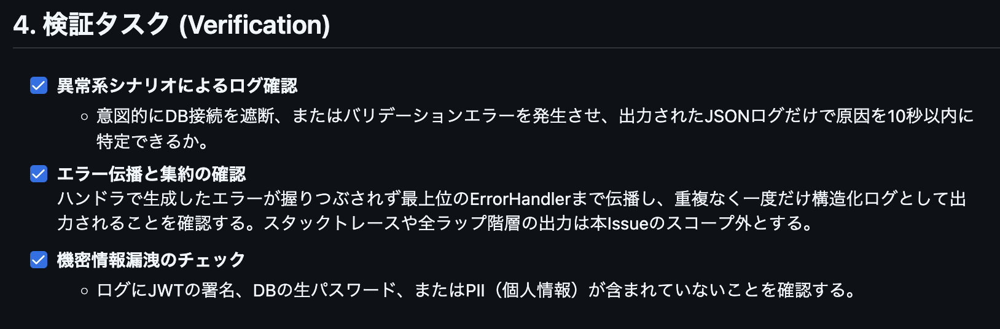

+++
date = '2026-06-11T11:13:16+09:00'
draft = false
tags = ["log"]
title = 'slogを使った構造化ログ（実装編）'
+++


## GoのslogとカスタムエラーをECアプリに導入した設計判断

- 今回学習したslogを使ったログ出力をECアプリに導入することで、手を動かしてコードレベルの理解を深める

- 以下の検証タスクをクリアできる状態をゴールとして実装を進めた


## 現状の確認
- エラーログ出力はエラーレスポンス用のヘルパー関数`RespondError()`でメッセージのみ出力している。エラー型などの情報は受け渡さずハンドラで文字列出力を行うのみ
- 正常終了時はログ出力などは特になし

認証エラーでの実装例
```go
	return func(c *gin.Context) {
		raw, exists := c.Get("userID")
		if !exists {
			respond.RespondError(c, http.StatusUnauthorized, "認証が必要です")
			return
		}
```

### 目指すべき形

- ハンドラ
  - カスタムエラー構造体を定義しハンドラは発生したエラーに合わせたカスタムエラーをラップする
  - 正常終了の場合は、処理の終端で通常イベントログ出力用ヘルパーを呼び出す
- ログ出力基盤 
  - ErrorHandlerミドルウェアで、コンテキストのエラーを取り出し、HTTPステータス・レスポンスメッセージ・ログ属性を生成する
  - 必要に応じてPIIのマスキング処理
- `request_id`,`duration_ms`などのログ用の情報を付与

## 進め方
- 一度に集約したミドルウェア呼び出しに変更することは難しいので以下のように段階を分けて進める

```
既存のエラーレスポンスの改良
↓
カスタムエラー構造体の設計
↓
カスタムエラーの適用
↓
ログ設計
↓
ログ実装
```
### 1.  カスタムエラー構造体の作成、適用
- `RespondError(err error, msg string)`のerrをカスタムエラー構造体呼び出しに変更
- `RespondWithError(c *gin.Context, err error)`に変更
- HTTPステータス、レスポンスメッセージの生成は`http.go`で処理
```go
	return func(c *gin.Context) {
		raw, exists := c.Get("userID")
		if !exists {
			respond.RespondWithError(c, apperror.NewUnauthorizedError("", apperror.UnauthorizedMessageAuth))
			return
		}
```

> [Refactor: エラーレスポンス用関数のリファクタリング#71
Merged
](https://github.com/mizzky/sol/pull/71)

### 2. セントラルエラーハンドリング
- `RespondWithError`を廃止し、ハンドラはエラー生成時に`c.Error()`でコンテキストへエラーを積み、ミドルウェアへ移譲
```go
	return func(c *gin.Context) {
		raw, exists := c.Get("userID")
		if !exists {
			_ = c.Error(apperror.NewUnauthorizedError("", apperror.UnauthorizedMessageAuth))
			return
		}
```

> [Feat:セントラルエラーハンドラの実装#73](https://github.com/mizzky/sol/pull/73)


### 3. slogの追加
- JSONHandlerでJSON形式のログ出力
- `request_id`, `user_id`, `duration_ms`などのログ情報追加

エラーログの出力例

```json
{
    "time":"2026-06-11T05:19:10.772471218Z",
    "level":"WARN",
    "msg":"http_error",
    "message":"認証が必要です",
    "error_type":"UnauthorizedError",
    "status":401,
    "method":"GET",
    "route":"/api/orders",
    "request_id":"7208880d-7d10-4e26-b4b2-e1c447e6e1a4",
    "duration_ms":0.059
}

```

[Feature: slogの追加#79](https://github.com/mizzky/sol/pull/79)


### 4. 正常系ログの出力
- ハンドラでログ出力用のヘルパー関数を呼び出す
```go

func LogEvent(c *gin.Context, in EventInput) {
	level := in.Level

	if level == 0 {
		level = slog.LevelInfo
	}

	msg := in.Message
	if msg == "" {
		msg = in.Event
	}

	attrs := BuildAttrs(c, in)
	slog.LogAttrs(c.Request.Context(), level, msg, attrs...)
}
```

呼び出し側はこんな感じ

```go
    // 必要に応じてuser_idをコンテキストに受け渡す
    c.Set("userID", user.ID)

    logging.LogEvent(c, logging.EventInput{
        Event:  "auth_login_succeeded",
        Status: http.StatusOK,
        Level:  slog.LevelInfo,
    })
```

正常系ログの出力例

```json
{
    "time":"2026-06-11T05:27:03.326909871Z",
    "level":"INFO",
    "msg":"products_listed",
    "request_id":"a96b6908-8624-437d-a06b-932b27a6cb90",
    "method":"GET",
    "route":"/api/products",
    "status":200,
    "event":"products_listed",
    "duration_ms":1.149
}
```

## まとめ
- このタスクによって、正常系・異常系どちらもKV形式で構造化されたログ出力ができるようになった
- 設計時に検討したフィールドをすべて常時出力するのではなく、イベントごとに必要な属性を追加できる形にした
- コンテキストの伝播や、逆にスタックトレースとして全履歴を保持しない選択など取捨選択はあったが、オブザーバビリティへの入門として知見が得られた
- 外部APIと連携したrequest_idの確認や、ログを活用したトレースなどは触れられなかったので、時間があれば触れたい

## 実装中の気づき
- `errors.As()`を用いたラップエラーの取り扱い、エラー型のコンテキスト伝播や、ミドルウェア一元化によるログ汚染防止など実装で処理の流れを掴むことができ、理解が深まった
- レスポンスのリファクタリングとエラーメッセージの一元化にフォーカスしたため、通常ログの設計や実装が進行度合いとして遅れた
- 場当たり的にメールアドレスのマスキングのみ先に実装したためslog実装時にパスワード、トークンのマスキングを実装したことでマスキング処理が点在してしまい、最終的にredaction用の関数を作る二度手間になってしまった
  - その分ReplaceAttrの効果を実感できたり、得られた知見もある


### 主題Issue
- [構造化ロギングとエラーハンドリングの再設計 #60](https://github.com/mizzky/sol/issues/60)


### 設計Issue
- [ログレベル運用定義書 #65](https://github.com/mizzky/sol/issues/65)
- [ログ設計書 #74](https://github.com/mizzky/sol/issues/74)

### 実装Issue/PR
- [既存エラー返却用ヘルパー関数のリファクタリング#70](https://github.com/mizzky/sol/issues/70)
- [request_id ミドルウェア実装](https://github.com/mizzky/sol/issues/75)
- [slog ロガーの初期化とマスキング設定](https://github.com/mizzky/sol/issues/77)
- [ErrorHandlerの拡張役割](https://github.com/mizzky/sol/issues/80)
- [ログフィールドにrequest_idとuser_idを追加](https://github.com/mizzky/sol/issues/82)
- [通常イベントログ（INFO/DEBUG）実装](https://github.com/mizzky/sol/issues/85)
- [redaction ユーティリティ統合](https://github.com/mizzky/sol/issues/88)